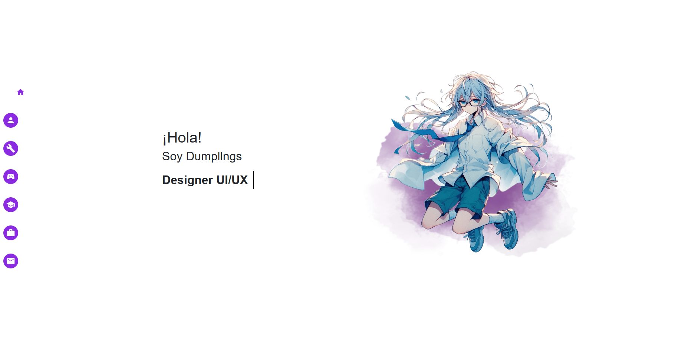

# Portafolio Personal - Dumplings

Este es el repositorio de mi portafolio personal, donde presento mis habilidades, experiencia, proyectos y hobbies. El portafolio fue desarrollado con HTML, CSS, y JavaScript, y utiliza Bootstrap para un diseño responsivo. Aquí podrás encontrar información detallada sobre mis conocimientos técnicos, mi formación académica y los proyectos en los que he trabajado.

## 🚀 Tecnologías utilizadas

- **HTML5:** Estructuración del contenido y diseño de la página.
- **CSS3:** Estilos y efectos visuales, incluyendo animaciones y diseño responsivo.
- **JavaScript:** Funcionalidades interactivas y efectos en la interfaz.
- **Bootstrap:** Framework para el diseño responsivo y la estructura de la página.
- **Font Awesome:** Para los íconos de las redes sociales y otras secciones.
- **Google Fonts:** Para agregar íconos adicionales en el sidebar.

## 📂 Secciones del Portafolio

1. **Inicio:** Una breve introducción con una imagen de perfil y enlaces a mis redes sociales.
2. **Acerca de mí:** Información sobre mí con un estilo inspirado en una terminal.
3. **Habilidades:** Tarjetas interactivas que muestran las tecnologías que manejo.
4. **Pasatiempos:** Un carrusel con información sobre mis hobbies y pasiones.
5. **Formación:** Un carrusel horizontal que muestra mi educación y programas en los que estoy estudiando.
6. **Experiencia:** Detalles de los proyectos en los que he trabajado, con enlaces a los repositorios y demos.
7. **Contacto:** Un formulario para ponerse en contacto conmigo.

## 🎨 Características

- **Diseño Responsivo:** Adaptable a diferentes dispositivos gracias a Bootstrap.
- **Animaciones:** Efectos visuales para una experiencia de usuario dinámica.
- **Interactividad:** Tarjetas que giran y carruseles animados para mostrar la información de manera atractiva.
- **Uso de iconos:** Integración de iconos personalizados con Font Awesome y Material Icons.

## 📸 Capturas



## 🛠️ Instalación

Para ejecutar el proyecto localmente:

1. Clona este repositorio:
    ```bash
    git clone https://github.com/tu_usuario/portafolio-personal.git
    ```
2. Abre el archivo `index.html` en tu navegador.

## 💌 Contacto

Si tienes alguna pregunta o sugerencia, ¡no dudes en contactarme a través de alguna de mis redes!
